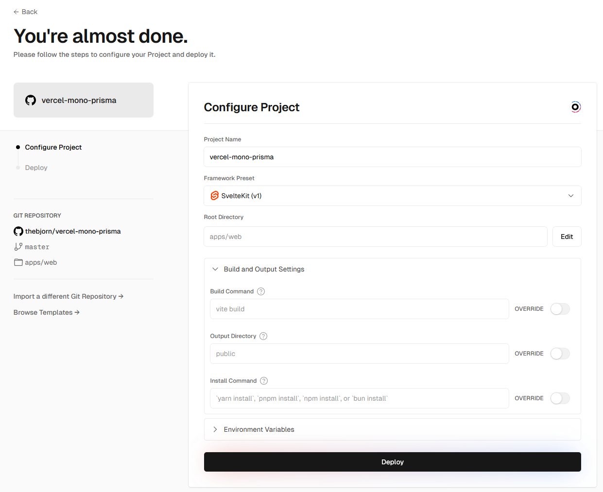
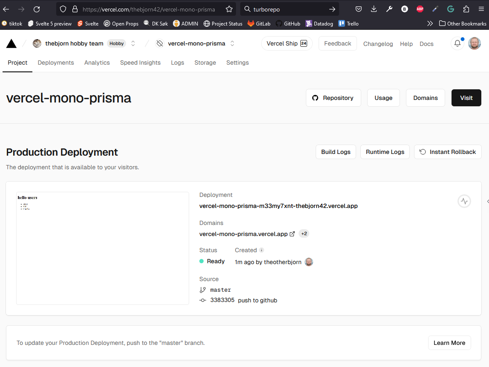
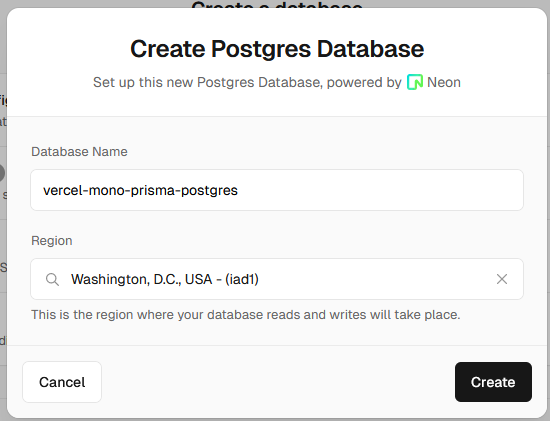

<!-- @import "[TOC]" {cmd="toc" depthFrom=1 depthTo=6 orderedList=false} -->

<!-- code_chunk_output -->

- [setup](#setup)
  - [head over to vercel and import the repo](#head-over-to-vercel-and-import-the-repo)
    - [configure](#configure)
    - [verify that everything runs ok](#verify-that-everything-runs-ok)
- [Database](#database)
  - [Create a Postgres database](#create-a-postgres-database)
- [Error 1](#error-1)
  - [Solution 1](#solution-1)
- [Prisma](#prisma)
  - [Where to install prisma..?](#where-to-install-prisma)
  - [Where should the prisma.schema file live?](#where-should-the-prismaschema-file-live)
- [Error 2](#error-2)
  - [Error 2.1](#error-21)

<!-- /code_chunk_output -->


# setup

```bash
> mkdir vercel-mono-prisma
> cd vercel-mono-prisma
> git init
> pnpm init
> touch .gitignore
```

- add pnpm-workspace.yaml
- add turbo.json
- fill `.gitignore` with standard content

```bash
> mkdir -p apps/web packages/db
> cd packages/db
packages/db> pnpm init
packages/db> mkdir -p src/lib
packages/db> touch src/lib/index.js
```

- add dummy `get_users` in index.js
- package.json: change name to `@repo/db`, add type/main/files fields.

```bash
> cd ../../apps/web
apps/web> pnpm init
```

- add `@repo/db` dependency
- add svelte/-kit/vite devDependencies

```bash
apps/web> mkdir -p src/routes
apps/web> mkdir static
apps/web> touch src\routes\+page.svelte
apps/web> touch src\app.html
apps/web> touch src\hooks.server.js
apps/web> touch svelte.config.js
apps/web> touch vite.config.js
```

- fill files with standard content.
- import `get_users` into `+page.svelte`, and display the result.
- unpack into static: https://toolcool.org/random-favicon-generator/?icon=square-rotated-off&category=Shapes&stroke-width=1.00&stroke-color=1-1-1-1&has-stroke=true&fill-color=255-255-255-1&has-fill=false&bg-color=255-255-255-1&bg-type=2&rotation=0.00&scale=0.80&sharpness=0.00&smoothness=0.00

```bash
apps/web> cd ../..
> pnpm i
> turbo dev --filter web
```

- verify that users are listed.
- stop turbo dev.

```bash
> turbo build
> git add .
> git commit -m "init"
```

- use vscode to push it to github.

## head over to vercel and import the repo

### configure


### verify that everything runs ok



# Database
## Create a Postgres database
(from vercel dashboard)


Following the SvelteKit instructions:
```bash
> npm i -g vercel
> vercel link
vercel-mono-prisma❱ vercel link
Vercel CLI 33.7.0
? Set up “c:\srv\work\vercel-mono-prisma”? yes
? Which scope should contain your project? thebjorn hobby team
? Found project “thebjorn42/vercel-mono-prisma”. Link to it? yes
✅  Linked to thebjorn42/vercel-mono-prisma (created .vercel and added it to .gitignore)
> vercel env pull .env
> pnpme add @vercel/postgres --filter web
```

- use pgAdmin to verify connection parameters.
- create a cart table to fit the `@vercel/postgres` example.
- add apps/web/src/routes/+page.server.js etc. according to docs.

# Error 1
```bash
> turbo dev --filter web
...
web:dev:   VITE v5.2.10  ready in 1074 ms
web:dev:
web:dev:   ➜  Local:   http://localhost:5176/
web:dev:   ➜  Network: use --host to expose
web:dev: VercelPostgresError: VercelPostgresError - 'missing_connection_string': You did not supply a 'connectionString' and no 'POSTGRES_URL' env var was found.
web:dev:     at createPool (file:///C:/srv/work/vercel-mono-prisma/node_modules/.pnpm/@vercel+postgres@0.8.0/node_modules/@vercel/postgres/dist/chunk-WDBQYBZQ.js:161:11)
web:dev:     at Object.apply (file:///C:/srv/work/vercel-mono-prisma/node_modules/.pnpm/@vercel+postgres@0.8.0/node_modules/@vercel/postgres/dist/chunk-WDBQYBZQ.js:215:16)
web:dev:     at load (C:\srv\work\vercel-mono-prisma\apps\web\src\routes\+page.server.js:5:20)
web:dev:     at Module.load_server_data (C:\srv\work\vercel-mono-prisma\node_modules\.pnpm\@sveltejs+kit@2.5.7_@sveltejs+vite-plugin-svelte@3.1.0_svelte@5.0.0-next.120_vite@5.2.10_@typ_bs34xdsk7mkkgs2ku7c2vw6ru4\node_modules\@sveltejs\kit\src\runtime\server\page\load_data.js:61:41)
web:dev:     at C:\srv\work\vercel-mono-prisma\node_modules\.pnpm\@sveltejs+kit@2.5.7_@sveltejs+vite-plugin-svelte@3.1.0_svelte@5.0.0-next.120_vite@5.2.10_@typ_bs34xdsk7mkkgs2ku7c2vw6ru4\node_modules\@sveltejs\kit\src\runtime\server\page\index.js:140:19 {
web:dev:   code: 'missing_connection_string'
web:dev: }
```

Building and deploying runs without errors when pushing to vercel, but no data is displayed from the database.
Manually setting POSTGRES_URL in the environment (even uri-encoded) does not connect.
```
web:dev: Error: Database connection string provided to `neon()` is not a valid URL. Connection string: "postgres://defaul...
```

## Solution 1
The following changes are needed to get this running locally:

```bash
diff --git a/apps/web/src/routes/+page.svelte b/apps/web/src/routes/+page.svelte
index 162f558..98e05d4 100644
--- a/apps/web/src/routes/+page.svelte
+++ b/apps/web/src/routes/+page.svelte
@@ -17,15 +17,8 @@
-    {#each data.cart as { name, user_id } (name)}
+    {#each data.cart.rows as {name, user_id} (name) }


diff --git a/apps/web/vite.config.js b/apps/web/vite.config.js
index e434d9f..6ef541e 100644
--- a/apps/web/vite.config.js
+++ b/apps/web/vite.config.js
@@ -1,9 +1,14 @@
 import { sveltekit } from '@sveltejs/kit/vite';
-import { defineConfig } from 'vite';
+import { defineConfig, loadEnv } from 'vite';


-export default defineConfig({
-    plugins: [
-        sveltekit()
-    ]
-});

+export default defineConfig(({mode}) =>        {
+     if (mode === 'development') {
+         const env = loadEnv(mode, './../../.env', '');
+     }
+     return {
+         plugins: [
+             sveltekit()
+         ]
+     }
+})
```

# Prisma

docs
:  https://vercel.com/docs/storage/vercel-postgres/using-an-orm#prisma

## Where to install prisma..?
Obviously I want the database code to live in the `packages/db` package

Copilot completion to the previous sentence... hmmm: , but prisma needs to be installed in the `apps/web` package.

**Note:** the command in the docs is wrong (according to: https://turbo.build/repo/docs/handbook/tools/prisma). It should be:

```bash
> pnpm add @prisma/client --filter @repo/db
> pnpm add -D prisma --filter @repo/db
```

## Where should the prisma.schema file live?
Vercel docs doesn't say...
.. heading over to the Prisma docs... (https://www.prisma.io/docs/getting-started/quickstart)

- ah.. there is a missing `prisma init` step in the vercel docs that creates the schema.prisma file
- but before that, this `public-hoist-pattern[]=*prisma*` should be added to the root .npmrc file (I'm assuming it is the monorepo root, since this is the turborepo docs...)
- "Run your package manager's install step to install the new dependencies."


```bash
vercel-mono-prisma❱ pnpm i
Scope: all 3 workspace projects
? The modules directory at "C:\srv\work\vercel-mono-prisma\node_modules" will be removed and reinstalled from scratch. Proceed? (Y/n) » true
```

(sigh, this takes a good 30 minutes on my quite fast machine...)

There seems to be multiple issues with running prisma in a monorepo, most of which have been open for a very long time... (I'm getting bad vibes here...):
- https://github.com/prisma/docs/issues/1288
- https://github.com/prisma/prisma/issues/12535
- https://github.com/prisma/prisma/issues/9726

```bash
> cd packages/db
packages/db> npx prisma init
packages/db> cp ../../.env .
packages/db> npx prisma db pull
```

- update prisma.schema, adding a `User` model
- update src/lib/index.js to use the prisma client and +page.server.js to use the new `get_users` function.
- clean up +page.svelte to display the users.

```bash
packages/db> npx prisma push
packages/db> npx prisma generate
packages/db> turbo dev --filter web
```

- use pgAdmin to verify that the `User` table has been created.
- manually add some rows to the `User` table.
- reload the browser page, and verify that the users are displayed.
- commit and push to github/vercel

# Error 2
```bash
[21:43:53.097] Running build in Washington, D.C., USA (East) – iad1
[21:43:54.052] Cloning github.com/thebjorn/vercel-mono-prisma (Branch: master, Commit: bedc84c)
[21:43:54.805] Cloning completed: 752.479ms
[21:43:57.710] Restored build cache
[21:43:57.877] Running "vercel build"
[21:43:58.736] Vercel CLI 34.1.7
[21:43:59.087] > Detected Turbo. Adjusting default settings...
[21:44:00.268] Detected `pnpm-lock.yaml` version 9 generated by pnpm 8
[21:44:00.268] Running "install" command: `pnpm install`...
[21:44:01.379] Scope: all 3 workspace projects
[21:44:02.000] ../..                                    |  WARN  Ignoring not compatible lockfile at /vercel/path0/pnpm-lock.yaml
[21:44:02.266] ../..                                    | Progress: resolved 1, reused 0, downloaded 0, added 0
[21:44:03.272] ../..                                    | Progress: resolved 7, reused 0, downloaded 7, added 0
[21:44:04.273] ../..                                    | Progress: resolved 8, reused 0, downloaded 8, added 0
[21:44:05.350] ../..                                    | Progress: resolved 9, reused 0, downloaded 8, added 0
[21:44:06.353] ../..                                    | Progress: resolved 81, reused 0, downloaded 75, added 0
[21:44:07.353] ../..                                    | Progress: resolved 134, reused 0, downloaded 96, added 0
[21:44:08.567] ../..                                    | Progress: resolved 137, reused 0, downloaded 98, added 0
[21:44:09.589] ../..                                    | Progress: resolved 139, reused 0, downloaded 101, added 0
[21:44:09.599] ../..                                    | +102 ++++++++++
[21:44:10.423] ../..                                    | Progress: resolved 139, reused 0, downloaded 102, added 102, done
[21:44:10.518] .../node_modules/@prisma/engines postinstall$ node scripts/postinstall.js
[21:44:10.543] .../node_modules/bufferutil install$ node-gyp-build
[21:44:10.544] .../node_modules/utf-8-validate install$ node-gyp-build
[21:44:10.736] .../node_modules/bufferutil install: Done
[21:44:10.745] .../node_modules/utf-8-validate install: Done
[21:44:11.458] .../node_modules/@prisma/engines postinstall: Done
[21:44:11.569] .../esbuild@0.20.2/node_modules/esbuild postinstall$ node install.js
[21:44:11.590] .../prisma@5.13.0/node_modules/prisma preinstall$ node scripts/preinstall-entry.js
[21:44:11.643] .../prisma@5.13.0/node_modules/prisma preinstall: Done
[21:44:11.657] .../esbuild@0.20.2/node_modules/esbuild postinstall: Done
[21:44:11.734] .../node_modules/@prisma/client postinstall$ node scripts/postinstall.js
[21:44:12.467] .../node_modules/@prisma/client postinstall: prisma:warn We could not find your Prisma schema at `prisma/schema.prisma`.
[21:44:12.468] .../node_modules/@prisma/client postinstall: If you have a Prisma schema file in a custom path, you will need to run
[21:44:12.468] .../node_modules/@prisma/client postinstall: `prisma generate --schema=./path/to/your/schema.prisma` to generate Prisma Client.
[21:44:12.469] .../node_modules/@prisma/client postinstall: If you do not have a Prisma schema file yet, you can ignore this message.
[21:44:12.489] .../node_modules/@prisma/client postinstall: Done
[21:44:12.533] .../node_modules/@sveltejs/kit postinstall$ node postinstall.js
[21:44:13.266] .../node_modules/@sveltejs/kit postinstall: Done
[21:44:13.624] 
[21:44:13.626]  WARN  Issues with peer dependencies found
[21:44:13.626] apps/web
[21:44:13.626] └─┬ @sveltejs/vite-plugin-svelte 3.1.0
[21:44:13.626]   └─┬ svelte-hmr 0.16.0
[21:44:13.626]     └── ✕ unmet peer svelte@"^3.19.0 || ^4.0.0": found 5.0.0-next.120
[21:44:13.626] 
[21:44:13.627] Done in 13.2s
[21:44:13.751] 
[21:44:13.751] Attention:
[21:44:13.751] Turborepo now collects completely anonymous telemetry regarding usage.
[21:44:13.751] This information is used to shape the Turborepo roadmap and prioritize features.
[21:44:13.752] You can learn more, including how to opt-out if you'd not like to participate in this anonymous program, by visiting the following URL:
[21:44:13.752] https://turbo.build/repo/docs/telemetry
[21:44:13.752] 
[21:44:13.772] • Packages in scope: web
[21:44:13.772] • Running build in 1 packages
[21:44:13.772] • Remote caching enabled
[21:44:13.923] web:build: cache miss, executing 0c851bc5fcd087af
[21:44:14.415] web:build: 
[21:44:14.415] web:build: > web@1.0.0 build /vercel/path0/apps/web
[21:44:14.415] web:build: > vite build
[21:44:14.415] web:build: 
[21:44:15.203] web:build: 7:44:15 PM [vite-plugin-svelte] You are using Svelte 5.0.0-next.120. Svelte 5 support is experimental, breaking changes can occur in any release until this notice is removed.
[21:44:15.203] web:build: work in progress:
[21:44:15.203] web:build:  - svelte-inspector is disabled until dev mode implements node to code mapping
[21:44:15.203] web:build: 
[21:44:15.239] web:build: vite v5.2.10 building SSR bundle for production...
[21:44:15.282] web:build: transforming...
[21:44:15.909] web:build: ✓ 104 modules transformed.
[21:44:15.976] web:build: rendering chunks...
[21:44:16.109] web:build: 
[21:44:16.109] web:build: node:internal/event_target:1100
[21:44:16.109] web:build:   process.nextTick(() => { throw err; });
[21:44:16.109] web:build:                            ^
[21:44:16.110] web:build: Error: @prisma/client did not initialize yet. Please run "prisma generate" and try to import it again.
[21:44:16.110] web:build: In case this error is unexpected for you, please report it in https://pris.ly/prisma-prisma-bug-report
[21:44:16.110] web:build:     at new PrismaClient (/vercel/path0/node_modules/.pnpm/@prisma+client@5.13.0_prisma@5.13.0/node_modules/.prisma/client/default.js:43:11)
[21:44:16.111] web:build:     at file:///vercel/path0/apps/web/.svelte-kit/output/server/entries/pages/_page.server.js:2:16
[21:44:16.111] web:build:     at ModuleJob.run (node:internal/modules/esm/module_job:222:25)
[21:44:16.111] web:build:     at async ModuleLoader.import (node:internal/modules/esm/loader:323:24)
[21:44:16.111] web:build:     at async Promise.all (index 2)
[21:44:16.111] web:build:     at async analyse (file:///vercel/path0/node_modules/.pnpm/@sveltejs+kit@2.5.7_@sveltejs+vite-plugin-svelte@3.1.0_svelte@5.0.0-next.120_vite@5.2.10/node_modules/@sveltejs/kit/src/core/postbuild/analyse.js:66:16)
[21:44:16.111] web:build:     at async MessagePort.<anonymous> (file:///vercel/path0/node_modules/.pnpm/@sveltejs+kit@2.5.7_@sveltejs+vite-plugin-svelte@3.1.0_svelte@5.0.0-next.120_vite@5.2.10/node_modules/@sveltejs/kit/src/utils/fork.js:22:16)
[21:44:16.111] web:build: Emitted 'error' event on Worker instance at:
[21:44:16.111] web:build:     at [kOnErrorMessage] (node:internal/worker:326:10)
[21:44:16.111] web:build:     at [kOnMessage] (node:internal/worker:337:37)
[21:44:16.111] web:build:     at MessagePort.<anonymous> (node:internal/worker:232:57)
[21:44:16.111] web:build:     at [nodejs.internal.kHybridDispatch] (node:internal/event_target:826:20)
[21:44:16.111] web:build:     at MessagePort.<anonymous> (node:internal/per_context/messageport:23:28)
[21:44:16.111] web:build: 
[21:44:16.111] web:build: Node.js v20.12.2
[21:44:16.124] web:build:  ELIFECYCLE  Command failed with exit code 1.
[21:44:16.137] web:build: ERROR: command finished with error: command (/vercel/path0/apps/web) /pnpm8/node_modules/.bin/pnpm run build exited (1)
[21:44:16.137] web#build: command (/vercel/path0/apps/web) /pnpm8/node_modules/.bin/pnpm run build exited (1)
[21:44:16.137] 
[21:44:16.137]   Tasks:    0 successful, 1 total
[21:44:16.138]  Cached:    0 cached, 1 total
[21:44:16.138]    Time:    2.381s 
[21:44:16.138] Summary:    /vercel/path0/.turbo/runs/2fsbJ0ufjyGzvmTsx3ZhK2bHres.json
[21:44:16.138]  Failed:    web#build
[21:44:16.138] 
[21:44:16.138]  ERROR  run failed: command  exited (1)
[21:44:16.212] Error: Command "turbo run build" exited with 1
[21:44:16.484] 
```

## Error 2.1
The first part of the error is that it can't locate the prisma schema file.

```bash
[21:44:11.734] .../node_modules/@prisma/client postinstall$ node scripts/postinstall.js
[21:44:12.467] .../node_modules/@prisma/client postinstall: prisma:warn We could not find your Prisma schema at `prisma/schema.prisma`.
[21:44:12.468] .../node_modules/@prisma/client postinstall: If you have a Prisma schema file in a custom path, you will need to run
[21:44:12.468] .../node_modules/@prisma/client postinstall: `prisma generate --schema=./path/to/your/schema.prisma` to generate Prisma Client.
[21:44:12.469] .../node_modules/@prisma/client postinstall: If you do not have a Prisma schema file yet, you can ignore this message.
[21:44:12.489] .../node_modules/@prisma/client postinstall: Done
```
- `turbo build` succeeds locally
- `vercel build` fails locally due to node version

```bash
web:build: Error: Unsupported Node.js version: v21.5.0. Please use Node 18 or Node 20 to build your project, or explicitly specify a runtime in your adapter configuration.
```

**Hmm..** The reason for choosing prisma was because development was easier. After spending several days on this, I'm starting to realize that this might have been a mistake.  Maybe drizzle will be functional in a monorepo...?

Yay! working :-)

The real repo still errors with

```bash
db:build:  ERR_PNPM_PUBLIC_HOIST_PATTERN_DIFF  This modules directory was created using a different public-hoist-pattern value. Run "pnpm install" to recreate the modules directory.
```

but at least that is a new error :-)